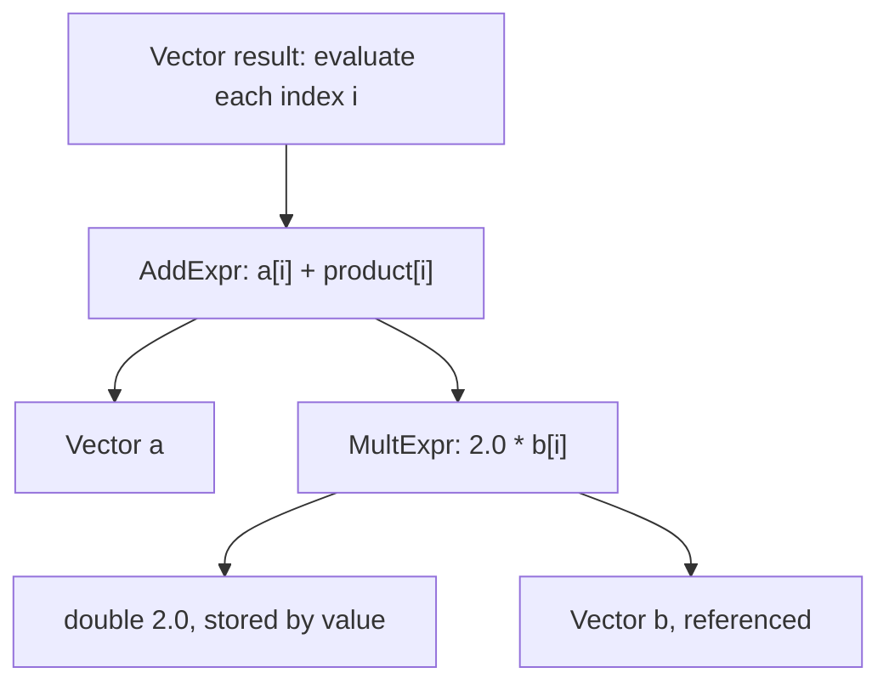

# Expression templates with C++23 explicit object parameters

This workspace is a teaching example of lazy, elementwise arithmetic on vectors
of `double`. It explores how C++23 **explicit object parameters**, commonly called
**deducing this**, relate to the Curiously Recurring Template Pattern (**CRTP**)
traditionally used for expression-template interfaces.

The implementation lives in namespace `ET23`. [main.cpp](main.cpp) is an
executable tutorial with 50 checks covering storage, arithmetic, lazy evaluation,
operand lifetimes, and conversion of expressions into owning vectors.

## Workspace contents

| File | Purpose |
| --- | --- |
| [expressionWrapper23.hpp](expressionWrapper23.hpp) | Defines the non-template base `Expr`, including experimental forwarding members using explicit object parameters and public fallback members. |
| [vectorExpr.hpp](vectorExpr.hpp) | Defines `Vector`, its owning `std::vector<double>` storage, expression construction and assignment, storage access, and iterator helpers. |
| [operators.hpp](operators.hpp) | Defines unary and binary expression nodes, scalar specializations, operation functors, and the arithmetic/function interface. |
| [main.cpp](main.cpp) | Explains and checks the supported behavior; prints individual results and returns failure if any check fails. |
| [tests/forwarding.cpp](tests/forwarding.cpp) | Instantiates the protected forwarding members and checks value/reference results and receiver forwarding. |
| [Makefile](Makefile) | Integrates the example with the surrounding course build configuration through `../../../Makefile.inc`. |


## Build and run

From this directory, use a compiler supporting C++23 explicit object parameters.
As the time being (september 26) not all the compilers supports deducing this.
Make sure that the local `Makefile.inc` sets CXX to at least g++ version 14 or clang version at least 20.

If unsure you can compile directly:

```sh
clang++-20 -std=c++23 -Wall -Wextra -Wpedantic main.cpp -o main
./main
```

A successful run ends with:

```text
50/50 checks passed; 0 failed.
```


The separate forwarding regression test exercises templates hidden by the
concrete members during normal expression evaluation:

```sh
clang++-20 -std=c++23 -Wall -Wextra -Werror -pedantic-errors -I. tests/forwarding.cpp -o /tmp/et23-forwarding
/tmp/et23-forwarding
```

## How an expression is evaluated

```cpp
#include "operators.hpp"
#include "vectorExpr.hpp"
#include <iostream>
#include <vector>

int main()
{
  ET23::Vector a(std::vector<double>{1, 2, 4});
  ET23::Vector b(std::vector<double>{3, 5, 2});

  ET23::Vector result = a + 2.0 * b;
  for(double value : result)
    std::cout << value << ' '; // 7 12 8
  std::cout << '\n';
}
```

`2.0 * b` creates a small multiplication node. Adding `a` creates an addition
node referring to its operands. Neither operation allocates a vector of results.
The nested types encode the calculation:



The constructor reserves destination storage, then evaluates `expression[i]`
for every index. That recursively applies the operation functors to the operand
values. Expression assignment resizes existing storage and performs the same
kind of evaluation. The arithmetic uses one destination traversal, without
intermediate result vectors; the compiler has concrete types available for
inlining. This example does not benchmark performance or guarantee vectorization.

For this formula, the root type is
`AddExpr<Vector, MultExpr<double, Vector>>`. Its lifetime lasts through the
initialization statement, so all temporary nodes remain alive during evaluation.

## The usual CRTP approach

A traditional expression interface makes the derived type a template argument
of its base. Here is a small, independent illustration; the `_impl` names keep
implementation hooks distinct from the public interface:

```cpp
#include <cstddef>

template <class Derived>
struct CrtpExpr
{
  std::size_t size() const
  {
    return static_cast<Derived const&>(*this).size_impl();
  }

  double operator[](std::size_t i) const
  {
    return static_cast<Derived const&>(*this).value_impl(i);
  }
};

struct CrtpValues : CrtpExpr<CrtpValues>
{
  std::size_t size_impl() const { return 3; }
  double value_impl(std::size_t i) const { return double(i + 1); }
};
```

The recurring part is `CrtpValues : CrtpExpr<CrtpValues>`. The base knows which
derived type to cast to because that type is part of its own specialization.
A consumer accepting `CrtpExpr<Derived> const&` can preserve this information by
remaining a template on `Derived`. Expression nodes similarly inherit from
specializations containing their own concrete types.

The calls use static polymorphism: no virtual functions or runtime type lookup
are required. The inheritance relationship must agree with the supplied
`Derived` argument for the downcast to be valid.

## Replacing the CRTP forwarding layer with deducing this

An explicit object parameter names the receiver of a member call. In
`size(this auto const& self)`, `auto` is deduced from the **static type** of the
object expression. The named parameter provides access to that object inside
the function. See the language proposal [P0847R7, Deducing this](https://www.open-std.org/jtc1/sc22/wg21/docs/papers/2021/p0847r7.html).

The analogous independent example is:

```cpp
#include <cstddef>

struct ExplicitExpr
{
  std::size_t size(this auto const& self)
  {
    return self.size_impl();
  }

  template <class Self>
  double operator[](this Self const& self, std::size_t i)
  {
    return self.value_impl(i);
  }
};

struct ExplicitValues : ExplicitExpr
{
  std::size_t size_impl() const { return 3; }
  double value_impl(std::size_t i) const { return double(i + 1); }
};
```

For `ExplicitValues values; values.size();`, the inherited function deduces
`self` as `ExplicitValues const&`. The base needs neither a `Derived` template
argument nor a downcast. `this auto const&` is abbreviated function-template
syntax; the indexing function shows the explicitly named `Self` equivalent.
A `this Self&&` parameter can also deduce constness and value category. These
members have no implicit `this` pointer and cannot be virtual. The proposal's
[CRTP discussion](https://www.open-std.org/jtc1/sc22/wg21/docs/papers/2021/p0847r7.html#crtp-without-the-c-r-or-even-t)
explores this use of the feature.

| Aspect | CRTP | Deducing this |
| --- | --- | --- |
| Base declaration | `template<class Derived> struct Base` | `struct Base` with member templates |
| Inheritance | `Derived : Base<Derived>` | `Derived : Base` |
| Concrete type comes from | The base's template argument | Deduction from the call's object expression |
| Forwarding mechanism | `static_cast<Derived const&>(*this)` | Named object parameter `self` |
| Dispatch in these examples | Compile time | Compile time |

Expression nodes still need templates to encode operand and operation types.
Replacing CRTP changes the interface forwarding layer, not the expression-tree
representation, evaluation strategy, or ownership rules. CRTP also remains
useful when the base class itself needs specialization by the derived type.

## What the current implementation actually uses

`Vector`, `BinaryOperator`, and `UnaryOperator` inherit from the same
non-template `Expr`. The wrapper declares protected forwarding members such as:

```cpp
std::size_t size(this auto const& self)
{
  return self.size();
}
```

It also supplies public, ordinary fallback members: `size()` returns zero and
indexing returns a dummy value or reference. The concrete classes declare their
own public `size()` and `operator[]`, hiding the base members with those names.
Consequently, the current arithmetic evaluation calls the concrete members
directly; it does **not** exercise the protected explicit-object forwarding
members. `Expr` serves as the inheritance marker for the evaluation constraints.

The independent example above illustrates an inherited forwarding interface
with distinct implementation hooks. It is an explanation of the technique,
not a claim that the current headers implement that exact interface. The header
comments distinguish the protected forwarding demonstration from the concrete
evaluation path. The forwarding-reference indexing overload uses `decltype(auto)`
and `std::forward<Self>(self)`: mutable vector indexing yields a reference, while
arithmetic-node indexing yields a computed value. Returning `double&`
unconditionally would make forwarding to a value-producing node ill-formed.

The concrete type must survive until evaluation. `Vector` therefore uses:

```cpp
template <std::derived_from<Expr> Expression>
Vector(Expression const& et);

template <std::derived_from<Expr> Expression>
Vector& operator=(Expression const& et);
```

These declarations are excerpts from the class. The constraint requires
`Expression` to satisfy `std::derived_from<Expression, Expr>`; the body can call
that expression type's `size()` and indexing operations directly.


## Operations, storage, and lifetimes

| Facility | Behavior |
| --- | --- |
| `a + b`, `a - b`, `a * b` | Elementwise binary operations; multiplication is not a dot product. |
| `a + 2.0`, `2.0 - a`, `a * 2.0`, etc. | Addition, subtraction, and multiplication support a `double` on either side. |
| `-a`, `ET23::exp(a)`, `ET23::log(a)` | Elementwise unary operations; finite real logarithms require positive inputs. |
| `Vector result = expression` | Evaluates into independent, owning storage. |
| `result = expression` | Resizes and evaluates into the destination. |
| `as_vector()` and conversion operators | Expose references to the underlying standard container, with const and mutable overloads. |
| Iteration | Mutable range-for uses `begin`/`end`; const iteration uses `ET23::cbegin`/`ET23::cend` or `as_vector()`. |
| `a + raw`, where `raw` is `std::vector<double>` | References the standard container directly through its `size()` and indexing interface. |

Non-scalar operands are stored by **const reference**, while `double` operands
are stored by value. A retained expression observes subsequent changes to its
vectors; a materialized `Vector` preserves the evaluated values.

Assuming `a` and `b` are live vectors of equal size:

```cpp
auto sum = a + b;             // Safe while a and b remain alive.
ET23::Vector snapshot = sum;  // Owns the evaluated values.
a[0] = 10.0;                 // Changes sum[0], but not snapshot[0].

auto product = 2.0 * b;
auto combined = a + product;  // Safe while a, b, and product remain alive.
ET23::Vector result = combined;
```

Do not retain `auto combined = a + 2.0 * b;`: the multiplication temporary dies
at the semicolon, leaving a dangling reference inside `combined`. Immediate
materialization, as in the first program, is safe. Temporary vector operands
have the same lifetime concern. Deducing this does not extend any lifetime.

This is a deliberately small implementation. Binary vector operands must have
equal sizes; `size()` checks this with `assert`, which disappears under
`NDEBUG`. Direct indexing does not perform that check. Use `double` scalar
literals such as `2.0`: the scalar specializations do not cover `int` or `float`.
Division is not implemented, and the free operator templates are unconstrained.
Keeping an `ET23` operand allows argument-dependent lookup to find these
operators without importing the whole namespace.

Same-size, pointwise assignments such as `a = -a` and `a = a + b` are tested.
There is no general mechanism for detecting aliasing or protecting operations
that resize referenced storage. More advanced ownership, shape checking, and
alias handling would be needed for a production numerical library.
