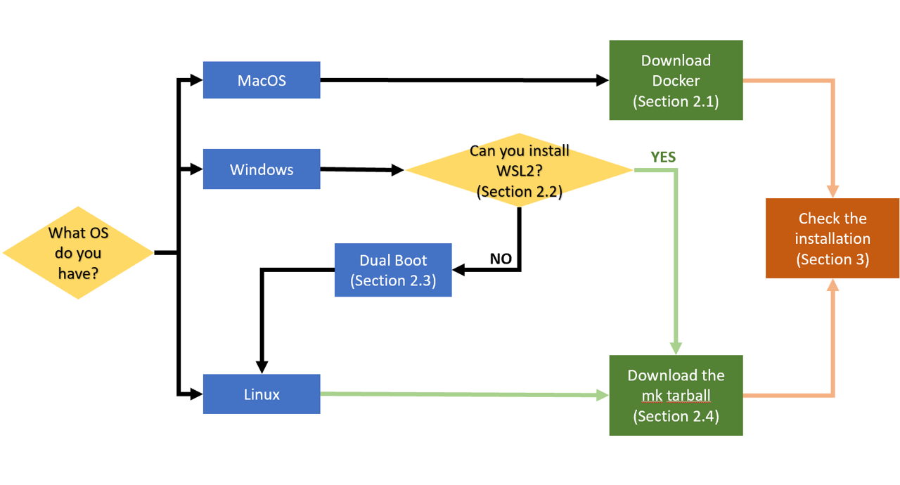

# Environment setup
For the laboratories of this course you will need two things:

1. a text editor (we warmly suggest [Visual Studio Code](https://code.visualstudio.com/), which is available for Linux, Windows and MacOS)
2. the mk-modules

## 1. What are mk modules?

[mk modules](https://github.com/elauksap/mk) bundle a set of scientific libraries compiled under the same toolchain. Once installed, they provide the command module, that has several subcommands:

```
module load <module name> 
```

loads the requested module. This creates a set of environment variables storing relevant paths for that library (e.g. `mkEigenPrefix`, `mkEigenInc`, ...). Use

- `env | grep mk`  to obtain a list of all the environment variables relative to mk modules
- `module list`: to show a list of currently loaded modules
- `module avail`: to show a list of all available modules (loaded or not)
- `module --help`: to show a list of all the commands

## 2. Installation
The mk modules are natively available only for (reasonably modern) Linux distributions. However, do not worry if you do not have a machine with Linux, here you find a flowchart of how you can obtain the mk modules (and a Linux distribution) depending on your OS:


### 2.1. Docker

#### 2.1.1 How it works
The two most important terms when it comes to `Docker` are **image** and **container**. Images are blueprints of VMs, and define the environment, a bit like classes in `C++`. Containers are instances of images, a bit like objects/instances in `C++`. `Docker` views a container as a sequence of changes made to its environment (the image), but the image itself never changes. So what we need to do to use `Ubuntu` is to download the image we provide and start a container on top of it. This container will then serve as our VM, and we can launch our shell in it, mount local folders to it, etc. We usually call the machine in which our container runs the **host** and the operating system running *inside* the container the **guest** (or *container* itself).

#### 2.1.2 Download Docker Desktop

As a first step, install the [Docker container environment](https://www.docker.com/). You can follow the instruction on the [official guide](https://docs.docker.com/get-docker/). **Please read it thoroughly**.

`Docker` is relatively heavy on RAM, and it might help to go to `Settings` and enabling the *Virtualization framework* under *Experimental features*.

#### 2.1.3 Pull the Docker image
From a terminal with admin privileges, run the command

```bash
docker pull elauksap/hpc_courses
```

The image is just a snapshot of the state of a Ubuntu distro, it is like a saving point from where you want to start. You can check your images with `docker image ls`.

#### 2.1.4 Use the Docker image 
To use your image you need to create a Docker container. To make a parallel with virtual machines, the Docker image is like the .iso of the OS, but then you have to install it. We want to create a container with the image we have just downloaded, give it a name (`--name pacs-env`) to remember its function and share a folder with the host so that we can exchange file easily (`-v /path/to/host/folder:/home/jellyfish/shared-folder`). The complete command is:

```bash
docker run --name pacs-env -v /path/to/host/folder:/home/jellyfish/shared-folder -it -d elauksap/hpc_courses
```

**WARNING:** to avoid problems `/path/to/host/folder` should not contain white spaces or special characters. For instance you can make your shared folder with the command `mkdir shared-folder` and than `/path/to/host/folder` would be `/home/user/shared-folder` (use global path starting with `/`, avoid using `~`).

You have now created a container. To turn on the container type:

```bash
docker start pacs-env
```
To enter into the container run:

```bash
docker exec -it pacs-env /bin/bash
```
You can leave the container and return to your OS with `exit`. You can check your containers and their status with the command

```bash
docker ps -a
```
If the status of the container is `UP`, you can stop it with

```bash
docker stop pacs-env
```
Once you have created your container remember to **do not** use again the command `run` but just `start`. Otherwise you will create every time a new container. If you want to remove a container you created for mistake you can run:

```bash
docker rm <name-of-the-container>
```

Always remember that documentation is your best friend! Do not panic, just type:
```bash
docker --help
```

#### 2.1.5 Day to day
This section provides a quick reminder of the workflow if you have already gone through all the steps above.

Write code in your favorite editor and **store the files in the shared folder**.

Launch `Docker Desktop` and open a terminal. Check your container status with

```bash
docker ps -a
```

If the container is not already running, start it with

```bash
docker start pacs-env
```

Log into a shell of the container just started with

```bash
docker exec -it pacs-env /bin/bash
```

and locate the shared folder (mounted under `~/shared-folder/`). Anything you add to this folder will be visible from both the host and the container, under the respective mount points. Then, you can compile code and run command-line tools and executables from the container shell, *e.g.* with

```bash
g++ main.cpp -o main
./main
```

When you are done working, exit and stop the container with

```bash
exit
docker stop pacs-env
```

Now you can exit `Docker Desktop`.


### 2.2 WSL
First of all, on Windows we suggest to use [Windows Terminal](https://apps.microsoft.com/store/detail/windows-terminal/9N0DX20HK701) as your preferred terminal.

Windows Subsystem for Linux (WSL) is a feature of Windows that allows developers to run a Linux environment without the need for a separate virtual machine or dual booting. 

To install it follow the [official guide](https://learn.microsoft.com/en-us/windows/wsl/install). Make sure to install WSL 2 (you can find the details in the guide). As Linux distro we suggest Ubuntu.

Here you can find a [summary of the WSL commands](https://learn.microsoft.com/en-us/windows/wsl/basic-commands).

If the installation is successful the Linux distro profile should appear among your Windows Terminal profiles.

### 2.3 Dual Boot
Dual-booting is the act of installing two operating systems on a single computer, and being able to choose which one to boot. You will need to install a Linux distribution, we suggest Ubuntu 20.04 LTS or 22.04 LTS. 

Before proceeding we suggest you to backup you data. To install a Dual Boot you can follow the [official guide](https://help.ubuntu.com/community/WindowsDualBoot) (which is a bit dated) or this [unofficial tutorial](https://itsfoss.com/install-ubuntu-1404-dual-boot-mode-windows-8-81-uefi/).

After you're done, you can proceed to Section 2.3.

### 2.4 Download and install the modules

1. Download `mk-2022.0-full.tar.gz` from [this link](https://github.com/elauksap/mk/releases/download/v2022.0/mk-2022.0-full.tar.gz). E.g.
```bash
wget https://github.com/elauksap/mk/releases/download/v2022.0/mk-2022.0-full.tar.gz
```
2. `sudo tar xvzf mk-2022.0-full.tar.gz -C /` (~ 4.5GB required).

To load them you should type each time you open the terminal `source /u/sw/etc/bash.bashrc`. However you can add the following lines to the `${HOME}/.bashrc` file (or equivalent) to have them always loaded:
```bash
# mk.
source /u/sw/etc/bash.bashrc
module load gcc-glibc/11.2.0
module load eigen tbb
```

Complete user guide available [here](https://lmod.readthedocs.io/en/latest/010_user.html).

## 3. Test the installation

1. Using VS Code, open a folder and create a file `test-installation.cpp` with content:

```cpp
#include <Eigen/Eigen>
#include <iostream>

int main(int argc, char** argv)
{
        std::cout << "Successfully included Eigen." << std::endl;
        return 0;
}
```

2. Load the toolchain `source /u/sw/etc/profile`.

3. Make sure the Eigen module is loaded: ```
module load gcc-glibc/11.2.0 
module load eigen```.

3. Compile and run the test:

```bash
g++ -I ${mkEigenInc} test-installation.cpp -o test-installation
./test-installation
```

